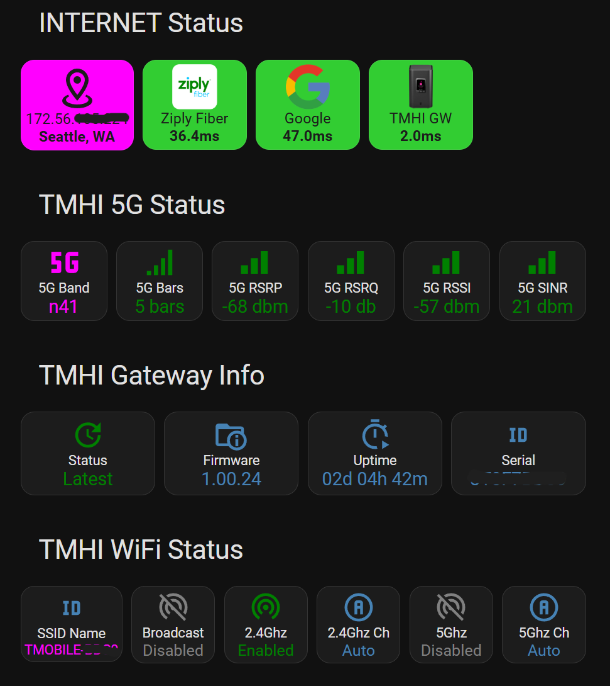

# T-Mobile Home Internet Integrations
I use the Arcadyan KVD21 gateway which has a simple REST API that can be used to configure and monitor the gateway.

## REST API sensors
This is the core of the custom integration to make remote API requests to the KVD21 REST API.

All of the REST sensor code can be found in [rest_sensors.yaml](rest_sensors.yaml).

First of all, there is an authentication endpoint `http://192.168.12.1/TMI/v1/auth/login` with which to get an access token to be used on subsequent requests. For simplicity I just store that in an entity, but it could be secured further.

Then there are two other calls from which the WiFi access point info `http://192.168.12.1/TMI/v1/network/configuration/v2?get=ap` and cellular connection info `http://192.168.12.1/TMI/v1/gateway?get=all` entities are generated.

## Template sensors
There is only one [templates.yaml](templates.yaml) sensor and it converts an uptime timestamp to a more human-readable format like `01d 15h 22m`.

## Dashboard Cards
I make heavy use of the [custom:button-card](https://github.com/custom-cards/button-card) in my dashboard.

The sensors generated are displayed on a dashboard page that contains 1 x horizontal stack for the INTERNET Status section and 4 x horizontal stacks for the gateway specific information:

The 4G cellular connection info is hidden in this screenshot because my gateway recently switched to use only a 5G SA connection. There is a conditional for that row to hide it if the 4G band entity is unknown.

The source for the dashboard cards can be found in [dashboard-items.yaml](dashboard-items.yaml).

The ping sensors in the first row are generated using the built-in ping integration as described here [Ping (ICMP)](https://www.home-assistant.io/integrations/ping/).

The card labelled TMHI GW has a click action that calls a rest command to remotely reboot the gateway. See [rest_command.yaml](rest_command.yaml) for the source.

Hope this is helpful !
